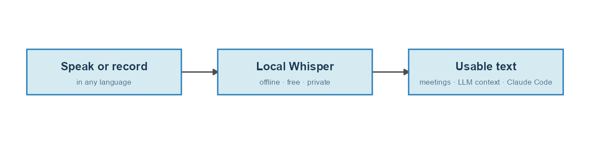

Voice input is everywhere in AI tools now, and it is almost always English-first. Claude Code's dictation, and most built-in voice features, cover English and a short list of major languages; plenty of languages are not covered at all. The moment I want to dictate in Hebrew, or transcribe a Hebrew meeting, I get pushed toward signing up for a paid provider, managing an API key, and watching a per-minute meter tick.

I wanted none of that. So I set up speech-to-text that runs **entirely on my own laptop**: offline, free, and with no limits. The whole point is to handle the case the big tools handle worst, a language other than English.

# What I run

The setup is one open-source engine and one model. The engine is [faster-whisper](https://github.com/SYSTRAN/faster-whisper), a fast reimplementation of OpenAI's Whisper. The model is [`ivrit-ai/whisper-large-v3-turbo-ct2`](https://huggingface.co/ivrit-ai/whisper-large-v3-turbo-ct2), a Hebrew fine-tune of Whisper's `large-v3-turbo`.

It all runs on a regular laptop: an AMD Ryzen 7 8845HS with 32 GB of RAM and no usable GPU. The machine does have an integrated AMD GPU, but faster-whisper only accelerates on NVIDIA cards, so in practice everything runs on the CPU. That turns out to be fine.

# Three ways I use it

**Transcribing online meetings.** After a call, I run the recording through a small Claude Code skill that calls the local model and writes a timestamped transcript. Nothing leaves the machine, which matters when the meeting was not mine to upload to some third-party service in the first place.

**Handing an LLM the full context, by talking.** When I want a model, usually Claude Code, to really understand what I am after, typing is the bottleneck. People who work with these tools have made the point well: speaking carries far more context than typing. Typing pushes you toward short, careful, pruned input, while talking lets you spill everything that is actually in your head. I do this two ways, both local: a push-to-talk key that dictates straight into the prompt, and longer recordings I transcribe and hand over. More on the hotkey just below.

**Recording while driving.** This is how this very post came to be. I record a long voice memo in the car describing what I want to build, and when I get to my desk I drop the audio file into Claude Code together with a prompt. Claude transcribes it and already has the full context for the task. You are reading the output of exactly that loop.

# Talking to the model with a hotkey

The "by talking" part started as recorded memos, but the version I reach for all day is live. I wired a push-to-talk dictation key into the laptop: I tap the `` ` `` key, just left of the 1, say whatever I want in Hebrew, tap it again, and a second or two later the transcribed text is pasted straight into whatever has focus, whether that is the Claude Code prompt, an editor, or a browser field. The same local model does the work, so it stays offline and free, and it handles Hebrew that the built-in dictation does not.

It runs as a small background daemon that loads the model once and stays resident, so each utterance only pays for transcription, not for loading the model. It starts hidden at login, so the key is simply always there. A second shortcut, Ctrl+Alt+`` ` ``, toggles dictation on and off, so when I actually want to type a backtick the key behaves normally again.

This is the piece that turns "hand the model full context by talking" into a habit rather than a chore. There is no app to open and no file to move: think out loud, tap, and the model has the paragraph you would never have bothered to type.

# Is it good, and is it fast?

**Quality.** The Hebrew fine-tune is genuinely good on spontaneous, accented speech, well beyond the generic Whisper model of the same size. Numbers and dates sometimes come out spelled as words, which is a quick fix.

**Speed.** I measure it as the ratio of audio length to processing time. On my CPU the turbo model runs at roughly **1.0 to 1.4x real time**: a 9.5-minute recording took about 9.5 minutes, and a 17-minute recording about 12, since the longer one had more silence for the voice-activity filter to skip. A typical meeting transcribes in about its own length, in the background, while I get on with something else.

One knob worth knowing about: my CPU has no efficient `float16` support, so the model auto-converts to `float32`. Switching the compute type to `int8` is faster on a CPU, and it is the first thing to try if you want more speed without buying hardware.

# Which model for which machine

You do not need my exact setup. The model you can run depends mostly on your RAM, and on whether you have an NVIDIA GPU:

| Your machine             | Model                          | Compute type |
|--------------------------|--------------------------------|--------------|
| 8 GB RAM, no NVIDIA GPU  | `small`                        | `int8`       |
| 16 GB RAM, no NVIDIA GPU | `large-v3-turbo`               | `int8`       |
| 32 GB RAM, no NVIDIA GPU | `large-v3-turbo` or `large-v3` | `int8`       |
| NVIDIA GPU, 6 GB+ VRAM   | `large-v3`                     | `float16`    |

The standout option is `large-v3-turbo`: at 809 million parameters it is roughly half the size of full `large-v3` and several times faster, for almost the same accuracy. **For a non-English language, skip the `tiny` and `base` models, which are weak outside English. Use `small` at the very least, and look for a fine-tune in your language before settling for a generic model.** A dedicated fine-tune usually beats the generic model of the same size, which is exactly why I use the Hebrew one.

# Setting it up yourself

I put the whole setup in a small, standalone repo you can clone, fork, or star: [**github.com/matanhakim/local-voice-llm**](https://github.com/matanhakim/local-voice-llm). It has three standalone parts: setting up the local Whisper model, the push-to-talk dictation daemon described above, and the transcription skill you can drop into Claude Code or run on its own. The model-setup guide doubles as a recipe you can hand to Claude Code or any coding agent: it inspects your hardware, picks a model that fits your RAM and your language, installs faster-whisper, and drops in a transcribe script you can reuse. The speech always runs locally: no cloud, no API key, no meter.

The next step on my side is to take an old laptop that does have an NVIDIA GPU and turn it into a small transcription server, which would let me run an even stronger model several times faster. For now, a regular CPU laptop already covers everything above, in a language the big tools quietly leave out.